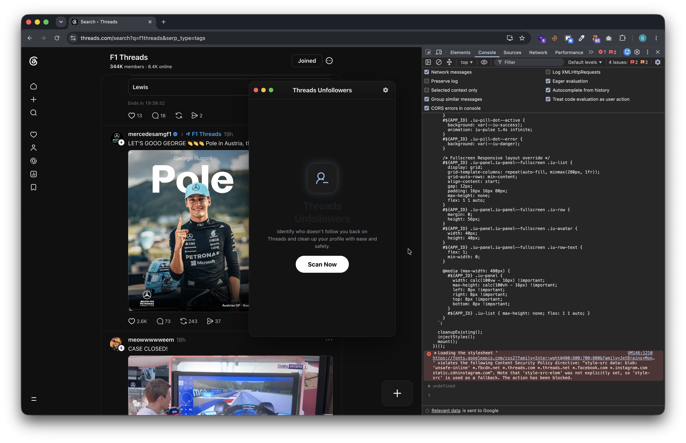
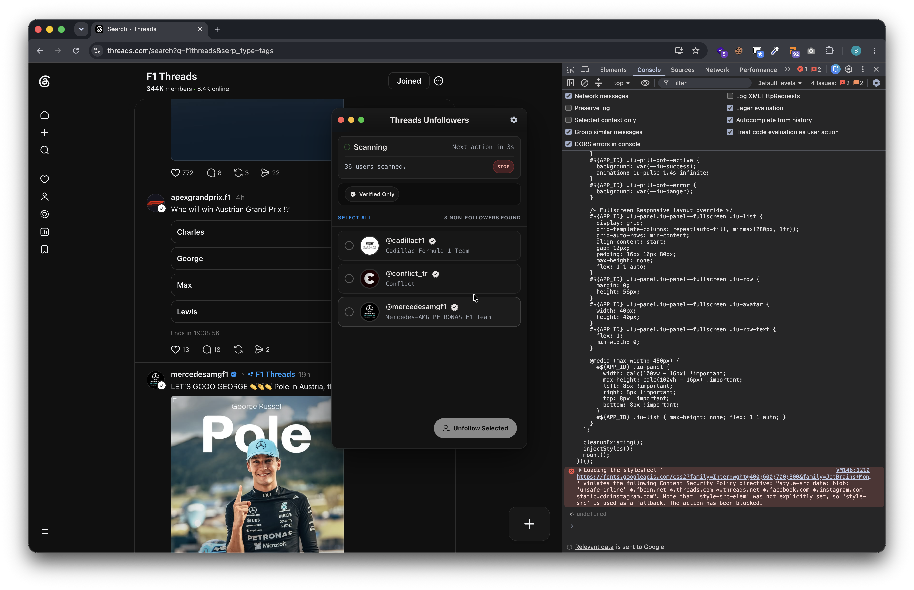

# Threads Unfollowers

See exactly who on Threads doesn't follow you back.

A free browser console script that scans your Threads following list and shows you exactly who doesn't follow you back. No login, no extension, no data leaves your browser.

---

## 🚀 Get the Script

To get the latest version of the script and run it, please visit the official page:
👉 **[bakiun.github.io/threads-unfollowers](https://bakiun.github.io/threads-unfollowers)**

---

## How it works

### 1. Open Threads in your browser
Works on [threads.com](https://www.threads.com) in any desktop browser — Chrome, Firefox, Edge, Brave. You need to already be logged in.

### 2. Open the developer console
Press `F12` (or `Cmd + Option + J` on macOS / `Ctrl + Shift + J` on Windows/Linux), or right-click anywhere on the page and choose **Inspect**, then open the **Console** tab.

### 3. Paste the script and press Enter
Copy the minified script from [the website](https://bakiun.github.io/threads-unfollowers), paste it into your browser console on Threads, and press Enter. A sleek interactive control panel will open on your page.

### 4. Scan and manage unfollowers
Click **"Scan Now"** to retrieve accounts that don't follow you back. Select non-followers and safely unfollow them with custom timing intervals directly from the dashboard.

---

## What it does

### Features
* Runs locally, inside your own browser tab.
* Reads your following list safely using your existing session.
* Displays a beautiful interactive control panel directly on your page.

---

## Questions (FAQ)

### Does this script send my Threads data anywhere?
No. It runs entirely inside your own browser tab, using your already-logged-in session. Nothing is sent to any server — not ours, not anyone else's.

### Will this get my account flagged or banned?
The script only reads your following list — it doesn't automate follows, unfollows, or likes. That carries about the same risk as browsing the page normally. Tools that auto-unfollow at scale carry more risk; this isn't one of those.

### Do I need to install an extension or create an account?
No. There's nothing to install and no account to create. You copy a script and paste it into your browser's built-in developer console.

### Someone I know unfollowed me but didn't show up. Why?
The script reads your live following list at the moment you run it. If you've already unfollowed someone yourself, they won't appear in the results.

### Does it unfollow people for me?
No. It only generates a list. Unfollowing anyone on that list is a manual decision you make and carry out yourself.
